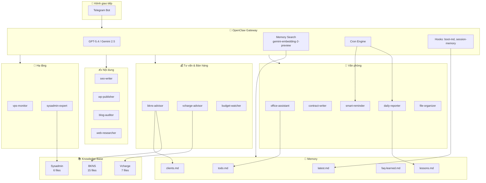

# 🦞 Bot Tôm — OpenClaw AI Assistant

> Trợ lý AI văn phòng & tư vấn khách hàng, chạy 24/7 trên VPS, giao tiếp qua Telegram.

## 🏗️ Kiến trúc

```
┌─────────────────────────────────────────────────────────────────┐
│                     🧠 OpenClaw Gateway                         │
│             (GPT-5.4 primary / Gemini fallback)                 │
│                                                                 │
│  ┌──────────┐   ┌──────────┐   ┌──────────┐   ┌─────────────┐ │
│  │ Telegram  │   │  Cron    │   │  Memory  │   │    Hooks     │ │
│  │ Channel   │   │  Engine  │   │  Search  │   │             │ │
│  └────┬─────┘   └────┬─────┘   └────┬─────┘   └──────┬──────┘ │
│       │              │              │                 │         │
└───────┼──────────────┼──────────────┼─────────────────┼─────────┘
        │              │              │                 │
        ▼              ▼              ▼                 ▼
┌───────────────────────────────────────────────────────────────────┐
│                         WORKSPACE                                 │
│                                                                   │
│  📋 Skills (14)           📚 Knowledge (3)    🧠 Memory (7)      │
│  ├─ bkns-advisor          ├─ bkns/ (15 files) ├─ latest.md       │
│  ├─ vcharge-advisor       ├─ sysadmin/ (6)    ├─ clients.md      │
│  ├─ office-assistant ★    └─ vcharge/ (7)     ├─ lessons.md      │
│  ├─ seo-writer                                ├─ faq-learned.md  │
│  ├─ contract-writer       📄 Docs             ├─ decisions.md    │
│  ├─ smart-reminder        ├─ BOOT.md ★        ├─ todo.md         │
│  ├─ daily-reporter ★      ├─ IDENTITY.md      └─ 2026-03-11.md  │
│  ├─ blog-auditor          ├─ TOOLS.md                            │
│  ├─ wp-publisher          ├─ AGENTS.md        ⏰ Cron (4 jobs)   │
│  ├─ web-researcher        ├─ SOUL.md          ├─ daily-report    │
│  ├─ vps-monitor           └─ HEARTBEAT.md     ├─ memory-reindex  │
│  ├─ file-organizer                            ├─ morning-brief   │
│  ├─ budget-watcher        🔧 Scripts          └─ weekly-cleanup  │
│  └─ sysadmin-expert       ├─ web_search.py                      │
│                           ├─ web_fetch.py     🔐 Secrets         │
│  ★ = nâng cấp/mới        └─ fill_contract.py └─ .env            │
│                                                                   │
└───────────────────────────────────────────────────────────────────┘
```

## 📊 Sơ đồ Skill Groups



## 📁 Cấu trúc thư mục

```
workspace/
├── BOOT.md                    # Personality + Self-learning protocol
├── IDENTITY.md                # Bot identity
├── TOOLS.md                   # Available tools & capabilities
├── AGENTS.md                  # Agent behavior rules
├── SOUL.md / HEARTBEAT.md     # Core personality files
├── .env                       # 🔐 Secrets (git-ignored)
│
├── skills/                    # 14 skills
│   ├── office-assistant/      # ★ NEW: Email, meeting, todo, quote
│   ├── bkns-advisor/          # ★ UPG: + client memory + /quote
│   ├── vcharge-advisor/       # EV charging consultant
│   ├── contract-writer/       # DOCX contract generation
│   ├── smart-reminder/        # ★ UPG: + recurring + pre-alerts
│   ├── daily-reporter/        # ★ UPG: + self-improvement
│   ├── seo-writer/            # SEO blog post writer
│   ├── wp-publisher/          # WordPress publisher
│   ├── blog-auditor/          # Blog health checker
│   ├── web-researcher/        # Web search & fetch
│   ├── vps-monitor/           # VPS health monitoring
│   ├── file-organizer/        # File management
│   ├── budget-watcher/        # Token/cost tracker
│   └── sysadmin-expert/       # Linux/Windows sysadmin
│
├── knowledge/                 # Knowledge base (28 files)
│   ├── bkns/                  # BKNS services & pricing
│   ├── sysadmin/              # System administration
│   └── vcharge/               # EV charging products
│
├── memory/                    # Persistent memory (7 files)
│   ├── latest.md              # Current session context
│   ├── clients.md             # Customer history
│   ├── lessons.md             # Lessons learned
│   ├── faq-learned.md         # Self-learned FAQ
│   ├── decisions.md           # Important decisions
│   └── todo.md                # Task management
│
├── scripts/                   # Python utilities
│   ├── web_search.py          # DuckDuckGo search
│   └── web_fetch.py           # URL content extractor
│
├── contracts/                 # Contract generation
│   ├── fill_contract.py
│   └── templates/
│
└── reports/                   # Daily reports
```

## 🔧 Config

| Setting | Value |
|---|---|
| **Model** | `openai-codex/gpt-5.4` (primary) |
| **Fallback** | `google-vertex/gemini-2.5-flash` |
| **Embeddings** | `gemini-embedding-2-preview` (3072 dims) |
| **Compaction** | `safeguard` (chunked) |
| **Tools** | `full` profile |
| **Channel** | Telegram |

## 🔐 Secrets

Tất cả secrets lưu trong `workspace/.env` (git-ignored):
- WordPress credentials
- Gemini API Key
- Telegram Bot Token
- Gateway Auth Token
- Google Cloud credentials path

## 📅 Cron Jobs

| Job | Giờ VN | Mô tả |
|---|---|---|
| `daily-report` | 22:00 | Báo cáo + self-review |
| `memory-reindex` | 10:00 | Reindex memory files |
| `morning-briefing` | 08:00 T2-T6 | Todo + lịch hôm nay |
| `weekly-cleanup` | 01:00 CN | Dọn memory cũ |
